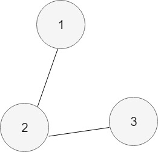

## 그래프의 표현

먼저 다음 그림을 보자.



이 그래프를 표현하기 위해서는 우선 정점의 집합을 만들어야 한다.

```
{1, 2, 3}
```

그리고 간선의 집합을 표현해야 하는데, 이는 서로 연결된 정점들의 순서쌍의 집합으로 표현할 수 있다. ``(정점1, 정점2)``
참고로 이 그래프는 간선에 방향이 없어서 방향 없는 그래프다.

```
{(1, 2), (2, 3)}
```

## 자료구조로 표현한 그래프

그래프는 크게 2가지 자료구조로 표현할 수 있는데, 그 목록은 다음과 같다.

1. 인접 행렬(adjacency matrix)
2. 인접 리스트(adjacency list)

### 인접 행렬(adjacency matrix)

고등학교 때 배운 그래프를 행렬로 나타내는 표기법이 바로 이 방법이다.  
컴퓨터를 사용해서 인접 행렬로 나타낸 그래프의 표현을 사용하기 위해서는 다음과 같이 한다.  


* 정점의 개수를 N이라고 했을 때, N*N 크기의 이차원 배열을 사용한다.
* A[i][j] = 1 또는 0(i -> j인 간선이 있다면 1 아니면 0)

코드로 표현하면 다음과 같다.(다음 시간에)

### 인접 리스트(adjacency list)

각 정점을 대표하는 원소에 그 원소에 대한 간선 정보를 매달하서 표현하는 방법이 바로 인접 리스트로 그래프를 표현하는 방법이다.  


인접 리스트는 보통 링크드 리스트를 이용해서 구현한다.  
그러나 링크드 리스트는 구현하는데 시간이 오래걸리기 때문에, 주로 vector와 같이 길이를 변경할 수 있는 배열을 이용해서 구현한다.

이를 코드로 구현하면 다음과 같다.(다음 시간에)

### 공간 복잡도

공간 복잡도를 보면 인접 행렬으로 구현하느냐, 인접 리스트로 구현하느냐에 따라 큰 차이가 있는데, 어지간하면 인접 리스트를 이용해서 구현하는 것이 좋다는 결론을 얻을 수 있다.  

* 인접 행렬: O(V^2)
* 인접 리스트: O(E)
